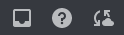
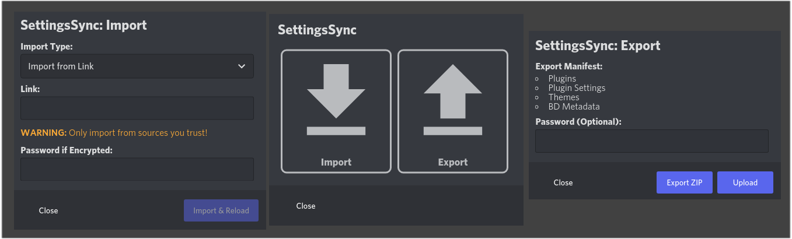

# SettingsSync
A plugin to help synchronize plugins, plugin configurations, themes, and BD settings across installations.

Export all of the above to either a ZIP file to transfer manually or to [tmp.ninja](https://tmp.ninja) and receive a link to transfer settings automatically.

To get started, click the SettingsSync icon in the top right corner, next to the Help and Inbox buttons. **You may need to restart Discord in order for SettingsSync to initialize for the first time after installation.**

## My Other Plugins
- [SplitLargeFiles](https://github.com/ImTheSquid/SplitLargeFiles)
- [StickerSnatcher](https://github.com/ImTheSquid/StickerSnatcher)